# Documentation for Creating a Custom Kubernetes Cluster Using Vagrant, Ansible, and Kubespray

This documentation provides step-by-step instructions for installing the necessary software and preparing the environment for working with Vagrantfile and virtual machines in Oracle VirtualBox. Additionally, it explains how to securely connect to devices using SSH and a public key to ensure secure communication between the control host and the cluster hosts.

- [1. WSL](#1-wsl)
- [2.  Oracle VirtualBox](#2-oracle-virtualbox)
- [3. Connecting VirtualBox to WSL](#3-connecting-virtualbox-to-wsl)
  - [3.1. Installing Vagrant ](#31-installing-vagrant)
  - [3.2. Installing Ansible](#32-installing-ansible)
  - [3.3. Configuring Ubuntu](#33-configuring-ubuntu)
  - [3.4. Importing the Vagrantfile](#34-importing-the-vagrantfile)
- [4. Configuring Virtual Machines](#4-configuring-virtual-machines)
  - [4.1. Generating Private and Public Keys](#41-generating-private-and-public-keys)
  - [4.2. DNS](#42-dns)
- [5. Kubespray](#5-kubespray)
  - [5.1. Initial Configuration](#51-initial-configuration) 

## 1. WSL
For this project, I will use WSL (Windows Subsystem for Linux). It is a feature of the Windows operating system introduced in Windows 10. In my case, I will use the Ubuntu distribution, which is the default installation within WSL.

To install the software, use the command: `wsl --install`, This will install the Ubuntu distribution. If you want to use a different distribution, run: `wsl --install -d <distribution-name>`. You can also use `wsl -o -l`, to display all available Linux distributions supported by WSL.

After installation, verify everything is installed correctly with: `wsl -l`

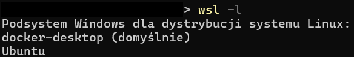

To switch to the Ubuntu system, enter: `wsl -d Ubuntu` This will automatically log you into the system.

## 2. Oracle VirtualBox
Oracle VirtualBox is free virtualization software that allows you to run multiple operating systems on a single physical computer. With VirtualBox, you can create and manage virtual machines, enabling you to test different operating systems, applications, and simulate various environments without installing them directly on your computer.

To install the software, visit the [VirtualBox Download](https://www.virtualbox.org/wiki/Downloads), page and choose the version for your host system. In my case, it’s Windows.

## 3. Connecting VirtualBox to WSL
In this step, we will connect VirtualBox to the WSL system. This is crucial for the proper functioning of our environment. For this project, I will use Ansible, which is only available on Linux. Using WSL, we can install Ansible and use it to manage tasks on virtual machines accessible via VirtualBox installed on Windows.
### 3.1. Installing Vagrant 
Vagrant is a tool for automating the creation and management of virtual environments. It allows you to quickly launch virtual machines on various platforms, such as VirtualBox, Docker, or AWS, using simple scripts. Vagrant automates configuration processes, making it easier to create consistent and repeatable development environments, reducing issues caused by differences in system configurations.
In our case, we will install Vagrant on the Ubuntu system. Detailed installation instructions can be found in the [Vagrant Installation Documentation](https://developer.hashicorp.com/vagrant/install#linux)

`wget -O- https://apt.releases.hashicorp.com/gpg | sudo gpg --dearmor -o /usr/share/keyrings/hashicorp-archive-keyring.gpg`

`echo "deb [signed-by=/usr/share/keyrings/hashicorp-archive-keyring.gpg] https://apt.releases.hashicorp.com $(lsb_release -cs) main" | sudo tee /etc/apt/sources.list.d/hashicorp.list`

`sudo apt update && sudo apt install vagrant`

Verify the Vagrant installation after completing these steps.

### 3.2 Installing Ansible
Ansible is a tool for automating configuration management, application deployment, and system orchestration. It enables managing multiple servers from a single location using simple configuration files (called playbooks) written in YAML format. Ansible is agentless and uses SSH for communication, making it easy to implement and highly flexible for automating IT processes.

To install Ansible, execute the following commands:

`sudo apt-add-repository ppa:ansible/ansible`

`sudo apt update`

`sudo apt install ansible`

Verify the Ansible installation after completing these steps.

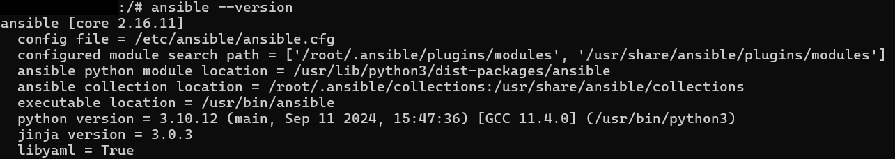

### 3.3 Configuring Ubuntu
To connect VirtualBox to Ubuntu, execute the following commands:

`echo 'export VAGRANT_WSL_ENABLE_WINDOWS_ACCESS="1"' >> ~/.bashrc`

`echo 'export PATH="$PATH:/mnt/c/Program Files/Oracle/VirtualBox"' >> ~/.bashrc`

`echo 'export VAGRANT_WSL_WINDOWS_ACCESS_USER_HOME_PATH="/mnt/c/Users/{username}"'`

`source ~/.bashrc`

Additionally, you need to install a Vagrant plugin:
`vagrant plugin install virtualbox_WSL2`

### 3.4 Importing the Vagrantfile
I recommend using the location specified as the user's home directory in Windows, like /mnt/c/Users/{username} in my case. Note that we do not use Windows-style paths like C:\Users\{username} but instead follow the Linux schema. Files shared with Linux are located in the /mnt directory.

The Vagrantfile is available in the repository, where it is described in detail. :)

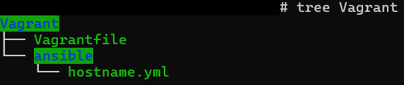

To start virtual machines, use the vagrant up command `vagrant up` **IMPORTANT: If you are performing operations on the Vagrantfile, you must be in the directory where the Vagrantfile is located.**

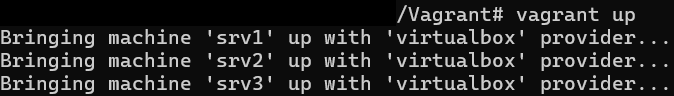

The output shows that tasks for the machine srv3 (similar tasks were completed for srv1 and srv2) were successfully executed and that all machines have been started with the system installed.

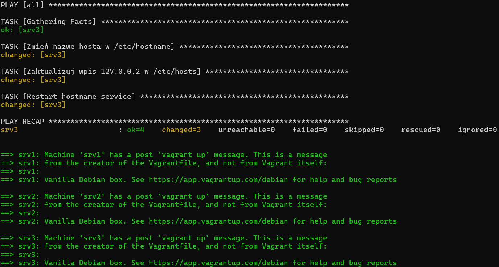

## 4. Configuring Virtual Machines
First, ensure that communication between WSL and the virtual machines works seamlessly. To verify, use the command vagrant ssh <machine_name>. Remember to execute commands in the folder containing the Vagrantfile.

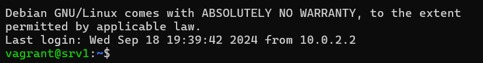

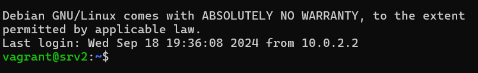

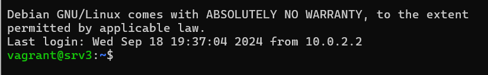

Access to all machines is available via SSH. Note that each machine has a default user named **vagrant**

### 4.1 Generating Private and Public Keys
You might not always be able to or want to use the `vagrant ssh <machine_name>` command. For this purpose, we’ll generate public and private keys using the OpenSSH tool.

To generate keys, use the command: `ssh-keygen -t ed25519 -b 521`, You’ll then be prompted to name the file and set a passphrase (both are optional, though setting a passphrase is recommended!).
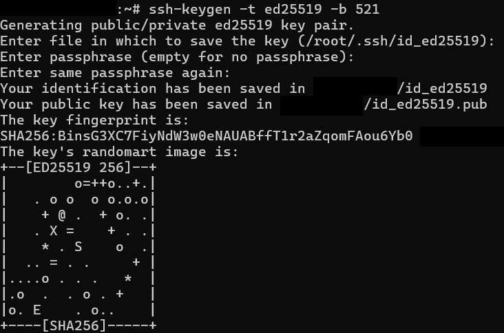

Next, copy the public key value so it can be added to remote hosts.

Using your favorite text editor, edit the file: /home/vagrant/.ssh/authorized_keys

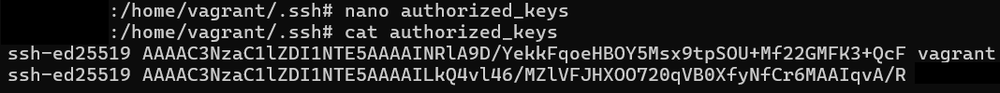

Repeat this process on srv2 and srv3 hosts.

### 4.2 DNS

It will be helpful for our hosts to recognize each other by DNS names rather than IP addresses, making it easier to work without remembering full IPs. To achieve this, edit the `/etc/hosts` file.

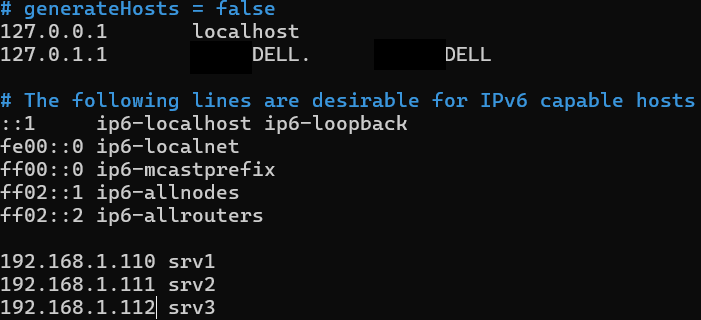

Add the IP addresses of your remote hosts along with their names. Perform this action on the WSL system and on the srv1, srv2, and srv3 hosts.

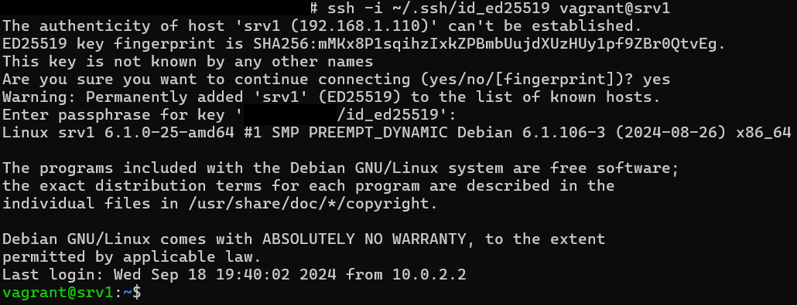

As shown, we successfully connected to the srv1 host using the key!

## 5. Kubespray
Kubespray is an open-source tool for automating the deployment and management of Kubernetes clusters. Based on Ansible, it enables the quick setup of Kubernetes clusters on various infrastructures (cloud, physical servers, or virtual machines). Kubespray supports features such as network configuration, security, and monitoring, providing flexible and production-ready Kubernetes environments.

You can find the Kubespray repository on GitHub: [Kubespray-repo](https://github.com/kubernetes-sigs/kubespray/tree/master)

First, download the repository to your WSL. This system will serve as the control host overseeing the entire cluster, so we will install and configure Kubespray here

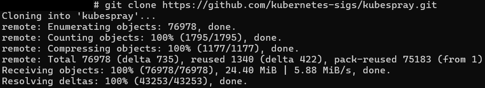

**IMPORTANT: Commands related to Kubespray must be executed while in the repository directory.**

### 5.1 Initial Configuration
First, install the Python package manager pip, as Kubespray relies on Ansible, which in turn is based on Python. Use the following command:

`sudo apt install python3-pip python3-distutils python3-apt`

Then, install the necessary dependencies from the `requirements.txt` file: `pip3 install -r requirements.txt`

The final configuration steps include editing the file

`cp -rfp inventory/sample inventory/mycluster` - inventory/{dir_name}

`declare -a IPS=(192.168.1.110 192.168.1.111 192.168.1.112)`

`CONFIG_FILE=inventory/mycluster/hosts.yaml python3 contrib/inventory_builder/inventory.py ${IPS[@]}`

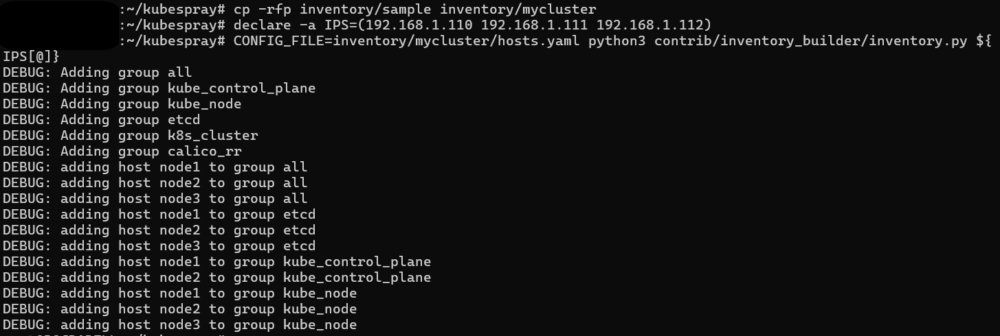

Edit configuration file: `~/kubespray/inventory/mycluster/hosts.yaml` to update the host settings, as the default DNS names do not match the actual host names.

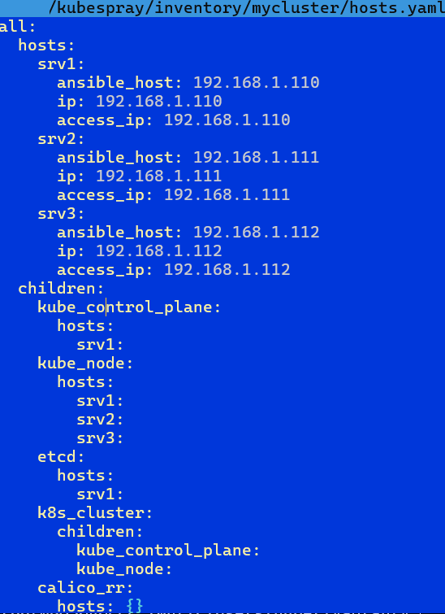

Finally, execute the following command to create the cluster:

`ansible-playbook -i inventory/mycluster/hosts.yaml --become --become-user=root -u vagrant --private-key=~/.ssh/id_ed25519 cluster.yml` 

This will set up the cluster on the hosts. The installation might take some time, so you can grab a coffee while keeping an eye on the messages displayed on the screen!

